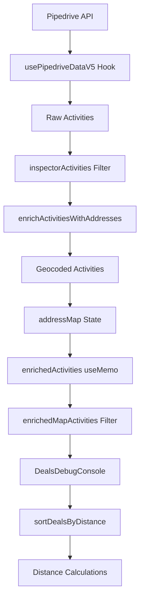

# Sitemap and Main Functionality

## Overview
This application is a staff location sorting system that integrates with Pipedrive CRM to manage property inspection schedules and optimize routes by analyzing distances between deals and inspections.

## Application Architecture

### Core Components

#### 0. InspectorCalendar (`/src/components/InspectorCalendar.jsx`)
**Weekly calendar view for managing inspection schedules and time slot recommendations**

**Key Features:**
- Displays weekly calendar with existing inspections
- Shows empty time slots for standard booking times (9am, 11am, 1pm, 3pm)
- **Time Slot Recommendations**: When opportunities toggle is enabled, shows "Deals" buttons on empty time slots
- **Deals Button Functionality**: Clicking "Deals" button opens DealsDebugConsole for that specific day, with sorting based on the previous inspection address

**Props Integration:**
- `enableOpportunities` - Controls visibility of deals recommendation buttons
- `onShowDealsDebugConsole` - Callback to open deals analysis for specific date
- Auto-enables opportunities toggle when data loads successfully
- Shows loading state while opportunities are being processed

**How to Add Inspections to Calendar:**
1. Click on any empty time slot to open booking form
2. Use "New Booking" button in developer tools
3. Inspections are automatically populated from Pipedrive activities
4. **Recommendation Workflow**: Click "Deals" button → Opens console → View nearby deals → Book optimal time slots

**Deal Recommendation Time Slot System:**
- **Individual Calculations**: Each time slot (9am, 11am, 1pm, 3pm) calculates deals based on its specific reference inspection
- **Reference Logic**: 9am uses FOLLOWING appointment, others use PREVIOUS appointment
- **Week-Wide Scope**: Calculates for all 28 time slots (7 days × 4 slots) across the current week
- **Color Coding**: Dark purple (5km) > Medium purple (10km) > Light purple (15km)
- **Button Format**: Shows "X Deals (5km)" with radius indicator

#### 1. InspectionDashboard (`/src/components/InspectionDashboard.jsx`)
**Main dashboard view that orchestrates the entire application**

**Key State Management:**
- `activities` - Raw activities from Pipedrive API
- `addressMap` - Enriched activity data keyed by activity ID (includes coordinates)
- `enrichedActivities` - Activities merged with addressMap data
- `enrichedMapActivities` - Filtered activities for selected inspector/date

**Key Functionality:**
- Fetches activities using `usePipedriveDataV5` hook
- Enriches activities with addresses via `enrichActivitiesWithAddresses()`
- Stores enriched data (including geocoded coordinates) in `addressMap`
- Creates `enrichedMapActivities` for current inspector/date selection

#### 2. DealsDebugConsole (`/src/components/DealsDebugConsole.jsx`)
**Debugging interface for viewing and sorting deals by proximity to inspections**

**Props Received:**
- `inspectionActivities` - Array of enriched activities with coordinates
- `selectedInspector` - Current inspector ID
- `selectedDate` - Current date selection

**Key Functionality:**
- Fetches deals using `getDealsForRegion()` or `getRecommendationDeals()`
- Sorts deals by distance using `sortDealsByDistance()`
- Displays distance statistics (within 5km, 10km, 15km)

#### 3. Data Flow for Distance Calculations



## API Integration

### Pipedrive Data Fetching

#### Activities (`/src/api/pipedriveRead.js`)
- `fetchActivitiesWithFilterV2()` - Fetches filtered activities with pagination
- `enrichActivitiesWithAddresses()` - Enriches activities with person addresses and coordinates
- `fetchPersonAddressForActivity()` - Extracts address from person/deal data

#### Deals (`/src/api/pipedriveDeals.js`)
- `getDealsForRegion()` - Fetches deals for specific region with coordinates
- `getRecommendationDeals()` - Fetches recommendation deals
- `sortDealsByDistance()` - Sorts deals by distance to inspection locations
- `calculateDealDistances()` - Calculates Haversine distances

### Geocoding (`/src/services/geocoding.js`)
- `geocodeAddress()` - Converts addresses to lat/lng using Google Maps API
- Caches results to avoid redundant API calls
- Used during activity enrichment process

## Distance Calculation System

### 1. Activity Enrichment Process
```javascript
// In InspectionDashboard.jsx
const doEnrich = async () => {
  const enriched = await enrichActivitiesWithAddresses(unenriched);
  setAddressMap(prev => {
    enriched.forEach(a => {
      if (a.personAddress) {
        updated[a.id] = {
          personAddress: a.personAddress,
          coordinates: a.coordinates,  // Geocoded coordinates
          lat: a.lat,
          lng: a.lng,
          addressSource: a.addressSource,
          label: a.label
        };
      }
    });
  });
};
```

### 2. Coordinate Preservation
```javascript
// enrichedActivities merges addressMap coordinates
const enrichedActivities = useMemo(() => {
  return activities.map(a => {
    if (a.coordinates) return a; // Keep existing
    if (addressMap[a.id]) {
      return { ...a, ...addressMap[a.id] }; // Add enriched data
    }
    return a;
  });
}, [activities, addressMap]);
```

### 3. Distance Calculation
```javascript
// In pipedriveDeals.js
export const calculateDealDistances = (deal, inspectionActivities) => {
  for (const activity of inspectionActivities) {
    // Try multiple coordinate sources
    let activityCoords = null;
    if (activity.coordinates?.lat && activity.coordinates?.lng) {
      activityCoords = activity.coordinates;
    } else if (activity.lat && activity.lng) {
      activityCoords = { lat: activity.lat, lng: activity.lng };
    }
    
    if (activityCoords) {
      const distance = calculateDistance(
        deal.coordinates.lat, deal.coordinates.lng,
        activityCoords.lat, activityCoords.lng
      );
      distances.push({ activity, distance });
    }
  }
};
```

## Regional Logic

### Region Detection
- Activities include deal labels with 3-digit region codes (e.g., "R03")
- `determineRegionFromInspections()` analyzes activity addresses
- Falls back to inspector's home region if no matches found

### Deal Filtering
- Deals are filtered by region using predefined filter IDs
- `REGIONAL_DEAL_FILTERS` maps regions to Pipedrive filter IDs

## Key Data Structures

### Activity Object (Enriched)
```javascript
{
  id: 1692826,
  subject: "Property Inspection - Ben W - ...",
  due_date: "2026-03-12",
  due_time: "09:00:00",
  owner_id: 2,
  personAddress: "22 Arafura Avenue, Loganholme QLD",
  coordinates: { lat: -27.6378, lng: 153.1094 },
  lat: -27.6378,
  lng: 153.1094,
  addressSource: "person_address_geocoded",
  label: "R03"
}
```

### Deal Object
```javascript
{
  id: 12345,
  title: "Property Sale - Logan",
  coordinates: { lat: -27.6400, lng: 153.1000 },
  address: "123 Main St, Logan QLD",
  addressSource: "deal_address_field",
  distanceInfo: {
    minDistance: 2.5,
    closestActivity: { ... },
    allDistances: [...]
  }
}
```

## Debugging and Troubleshooting

### Common Issues

1. **Activities missing coordinates**
   - Check if `enrichActivitiesWithAddresses()` is finding person addresses
   - Verify Google Maps API key is working
   - Check addressMap state contains coordinates

2. **Deals not sorting by distance**
   - Verify `inspectionActivities` prop has coordinates
   - Check deal objects have valid coordinates
   - Ensure `sortByDistance` toggle is enabled

3. **Region detection failing**
   - Check deal labels contain 3-digit region codes
   - Verify inspector has valid home region fallback

### Debug Console Output
The application provides extensive console logging:
- `🏠` Address enrichment progress
- `📍` Geocoding results  
- `📏` Distance calculations
- `🔍` Region detection
- `✅` Success indicators
- `⚠️` Warnings and missing data

## File Structure
```
src/
├── components/
│   ├── InspectionDashboard.jsx    # Main dashboard
│   ├── DealsDebugConsole.jsx      # Deals analysis tool
│   └── GoogleMapsView.jsx         # Map visualization
├── api/
│   ├── pipedriveRead.js           # Activity fetching & enrichment
│   └── pipedriveDeals.js          # Deal management & distance calc
├── services/
│   └── geocoding.js               # Address to coordinates conversion
└── hooks/
    └── usePipedriveDataV5.js      # Main data fetching hook
```